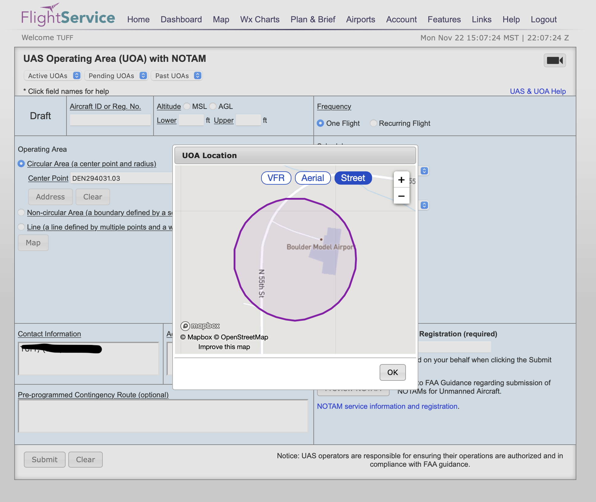

# Convert lat/long coordinates to "arinc 424" notation for filing drone flight NOTAM forms. 

## Download navaid location data from ourairports.com/data

CSV from https://ourairports.com/data/ 
```{r}
vor <- read.csv("navaids.csv")
class(vor)
```

## Convert downloaded point data to a spatially projected object.
```{r}
library(sf)

vor_spatial <- st_as_sf(vor, coords = c( "longitude_deg", "latitude_deg"), crs = 4326)
```


## Plot the global map of all available NAVAIDS (navigational aids)
```{r}
library(tidyverse)

ggplot(data=vor_spatial) +
  geom_sf()
```


# Provide latitude and longitude coordinates for the center point you would like to generate an ARINC424 9-digit code for.
These are coordinates for the Boulder Model Airport in Boulder, Colorado, USA. I've entered the longitude and latitude manually and converted those values to a spatial point object. 
```{r}
my_coords <- as.data.frame(matrix(c(1, -105.22488224977253, 40.09448137994711) ,1,3))
x <- st_as_sf(my_coords, coords = c("V2", "V3"), crs = 4326)
x
```

# Find the nearest neighbors for your point of interest
Now that the NAVAID and point of interests points are both spatially projected into the same spatial projections, it is easy to find which NAVAID points are closest to our point of interest. 
```{r}
library(nngeo)

nn <- st_nn( x, vor_spatial, k=10)

nearest_vor <- NA
nearest_vor <- vor_spatial[unlist(nn),]
nearest_vor
```

## Plot the nearest NAVAID points along with the point of interest
It is good to check the relative relationship between the point of interest and the available NAVAID locations. We are required to round our coordinates to the nearest full degree, which means that some NAVAID stations will produce better results because the vector between them and the point of interest coincidentely aligns along a whole value degree. This means that the nearest NAVAID station will not necessarily produce the most accurate destination point. The most accurate NAVAID station will be the one with the bearing closest to a whole number, even if they are farther away from the POI.  

```{r}
ggplot(data=nearest_vor) +
  geom_sf() +
  geom_sf(data=x, color="red")
```


# Calculate bearing and distance from each neigboring NAVAID to our POI
```{r}
library(geosphere)
vor_geom = st_sfc(nearest_vor$geometry)
x_geom = st_sfc(x$geometry)

b <- bearing(as(vor_geom, "Spatial"), as(x_geom, "Spatial"))

course <- matrix((b + 360) %% 360, 10,1)
course_corrected <- round(course) - nearest_vor$magnetic_variation_deg

dist <- distVincentyEllipsoid(as(vor_geom, "Spatial"), as(x_geom, "Spatial")) / 1852

course_corrected
dist
```

# Standardize notation for producing ARINC424 code
```{r}
standardized_dist <- round(dist, digits = 2)
nearest_vor  <- cbind(nearest_vor, standardized_dist , course_corrected)

nearest_vor <- nearest_vor[-which(nchar(nearest_vor$ident) == 2),]
```


# Print the best available codes to try in https://www.1800wxbrief.com/
Try the provided codes to see which one fits the best on 1800wxbrief.com. For me, the 3rd option works the best. 
```{r}
paste0(nearest_vor$ident, str_pad(round(nearest_vor$course_corrected), 3, pad = "0"),str_pad(round(nearest_vor$standardized_dist, digits = 2), 6, pad = "0"))
```




