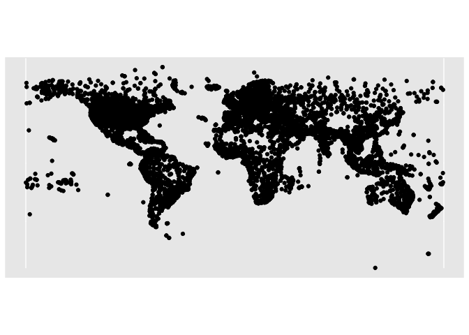
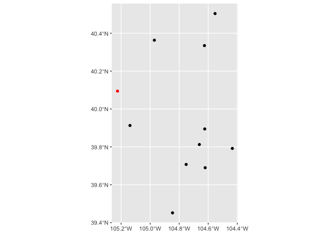

# Convert lat/long coordinates to “arinc 424” notation for filing drone flight NOTAM forms.

## Download navaid location data from ourairports.com/data

CSV from <https://ourairports.com/data/>

``` r
vor <- read.csv("navaids.csv")
class(vor)
```

    ## [1] "data.frame"

## Convert downloaded point data to a spatially projected object.

``` r
library(sf)

vor_spatial <- st_as_sf(vor, coords = c( "longitude_deg", "latitude_deg"), crs = 4326)
```

## Plot the global map of all available NAVAIDS (navigational aids)

``` r
library(tidyverse)

ggplot(data=vor_spatial) +
  geom_sf()
```

<!-- -->

# Provide latitude and longitude coordinates for the center point you would like to generate an ARINC424 9-digit code for.

These are coordinates for the Boulder Model Airport in Boulder,
Colorado, USA. I’ve entered the longitude and latitude manually and
converted those values to a spatial point object.

``` r
my_coords <- as.data.frame(matrix(c(1, -105.22488224977253, 40.09448137994711) ,1,3))
x <- st_as_sf(my_coords, coords = c("V2", "V3"), crs = 4326)
x
```

    ## Simple feature collection with 1 feature and 1 field
    ## Geometry type: POINT
    ## Dimension:     XY
    ## Bounding box:  xmin: -105.2249 ymin: 40.09448 xmax: -105.2249 ymax: 40.09448
    ## Geodetic CRS:  WGS 84
    ##   V1                   geometry
    ## 1  1 POINT (-105.2249 40.09448)

# Find the nearest neighbors for your point of interest

Now that the NAVAID and point of interests points are both spatially
projected into the same spatial projections, it is easy to find which
NAVAID points are closest to our point of interest.

``` r
library(nngeo)

nn <- st_nn( x, vor_spatial, k=10)
```

    ## lon-lat points

    ##   |                                                                                                                    |                                                                                                            |   0%  |                                                                                                                    |============================================================================================================| 100%

``` r
nearest_vor <- NA
nearest_vor <- vor_spatial[unlist(nn),]
nearest_vor
```

    ## Simple feature collection with 10 features and 18 fields
    ## Geometry type: POINT
    ## Dimension:     XY
    ## Bounding box:  xmin: -105.139 ymin: 39.4519 xmax: -104.434 ymax: 40.5039
    ## Geodetic CRS:  WGS 84
    ##         id            filename ident      name    type frequency_khz elevation_ft iso_country dme_frequency_khz
    ## 1019 86072   Jeffco_VOR-DME_US   BJC    Jeffco VOR-DME        115400         5734          US            115400
    ## 3008 88072        Colln_NDB_US    FN     Colln     NDB           400         4957          US                NA
    ## 2512 87575 Mile_High_VORTAC_US   DVV Mile High  VORTAC        114700         5270          US            114700
    ## 2276 87336   Denver_VOR-DME_US   DEN    Denver VOR-DME        117900         5440          US            117900
    ## 2243 87302        Buffs_NDB_US    DC     Buffs     NDB           332         4675          US                NA
    ## 1048 86101    Buckley_TACAN_US   BKF   Buckley   TACAN        109600         5580          US            109600
    ## 3054 88118    Falcon_VORTAC_US   FQF    Falcon  VORTAC        116300         5780          US            116300
    ## 3389 88452      Gill_VORTAC_US   GLL      Gill  VORTAC        114200         4910          US            114200
    ## 3110 88174        Skipi_NDB_US    FT     Skipi     NDB           321         5407          US                NA
    ## 481  85533        Casse_NDB_US    AP     Casse     NDB           260         6412          US                NA
    ##      dme_channel dme_latitude_deg dme_longitude_deg dme_elevation_ft slaved_variation_deg magnetic_variation_deg
    ## 1019        101X               NA                NA               NA               11.001                  9.420
    ## 3008                           NA                NA               NA                   NA                  9.397
    ## 2512        094X               NA                NA               NA               11.001                  9.257
    ## 2276        126X               NA                NA               NA               11.001                  9.263
    ## 2243                           NA                NA               NA                   NA                  9.284
    ## 1048        033X               NA                NA               NA               12.001                  9.286
    ## 3054        110X               NA                NA               NA               11.001                  9.243
    ## 3389        089X               NA                NA               NA               13.001                  9.270
    ## 3110                           NA                NA               NA                   NA                  9.190
    ## 481                            NA                NA               NA                   NA                  9.299
    ##      usageType  power associated_airport                 geometry
    ## 1019      BOTH   HIGH                     POINT (-105.139 39.913)
    ## 3008  TERMINAL MEDIUM                    POINT (-104.971 40.3632)
    ## 2512      BOTH   HIGH               KDEN POINT (-104.624 39.8947)
    ## 2276        LO   HIGH                    POINT (-104.661 39.8125)
    ## 2243  TERMINAL    LOW               KGXY POINT (-104.626 40.3347)
    ## 1048      BOTH MEDIUM               KBKF POINT (-104.752 39.7074)
    ## 3054      BOTH   HIGH                    POINT (-104.621 39.6901)
    ## 3389        LO   HIGH                    POINT (-104.553 40.5039)
    ## 3110  TERMINAL MEDIUM                    POINT (-104.434 39.7919)
    ## 481         LO MEDIUM                    POINT (-104.846 39.4519)

## Plot the nearest NAVAID points along with the point of interest

It is good to check the relative relationship between the point of
interest and the available NAVAID locations. We are required to round
our coordinates to the nearest full degree, which means that some NAVAID
stations will produce better results because the vector between them and
the point of interest coincidentely aligns along a whole value degree.
This means that the nearest NAVAID station will not necessarily produce
the most accurate destination point. The most accurate NAVAID station
will be the one with the bearing closest to a whole number, even if they
are farther away from the POI.

``` r
ggplot(data=nearest_vor) +
  geom_sf() +
  geom_sf(data=x, color="red")
```

<!-- -->

# Calculate bearing and distance from each neigboring NAVAID to our POI

``` r
library(geosphere)
vor_geom = st_sfc(nearest_vor$geometry)
x_geom = st_sfc(x$geometry)

b <- bearing(as(vor_geom, "Spatial"), as(x_geom, "Spatial"))

course <- matrix((b + 360) %% 360, 10,1)
course_corrected <- round(course) - nearest_vor$magnetic_variation_deg

dist <- distVincentyEllipsoid(as(vor_geom, "Spatial"), as(x_geom, "Spatial")) / 1852

course_corrected
```

    ##          [,1]
    ##  [1,] 330.580
    ##  [2,] 206.603
    ##  [3,] 284.743
    ##  [4,] 293.737
    ##  [5,] 233.716
    ##  [6,] 307.714
    ##  [7,] 301.757
    ##  [8,] 222.730
    ##  [9,] 287.810
    ## [10,] 326.701

``` r
dist
```

    ##  [1] 11.57876 19.89215 30.18620 31.02756 31.06735 31.86430 36.95246 39.41978 40.75664 42.32352

# Standardize notation for producing ARINC424 code

``` r
standardized_dist <- round(dist, digits = 2)
nearest_vor  <- cbind(nearest_vor, standardized_dist , course_corrected)

nearest_vor <- nearest_vor[-which(nchar(nearest_vor$ident) == 2),]
```

# Print the best available codes to try in <https://www.1800wxbrief.com/>

Try the provided codes to see which one fits the best on
1800wxbrief.com. For me, the 3rd option works the best.

``` r
paste0(nearest_vor$ident, str_pad(round(nearest_vor$course_corrected), 3, pad = "0"),str_pad(round(nearest_vor$standardized_dist, digits = 2), 6, pad = "0"))
```

    ## [1] "BJC331011.58" "DVV285030.19" "DEN294031.03" "BKF308031.86" "FQF302036.95" "GLL223039.42"


